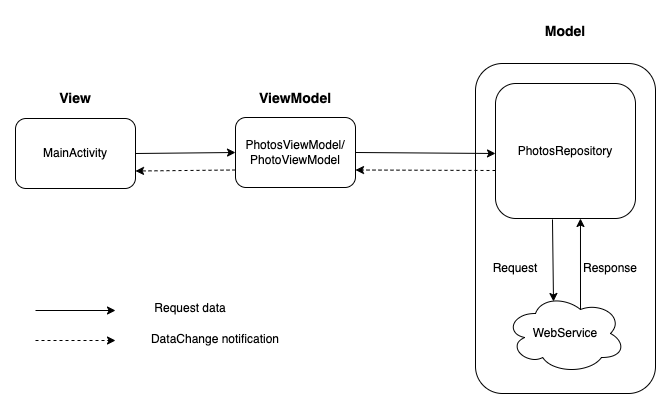
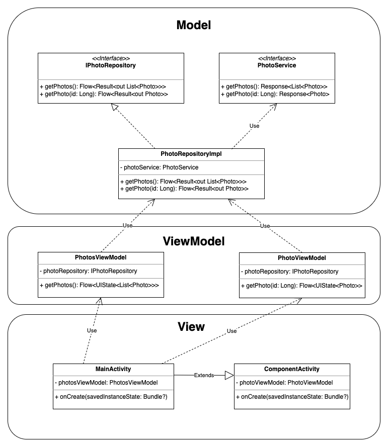

# Gallery app
## Goals
1. Create an Android application that displays information retrieved
   from the network.
2. App needs to fetch the photo objects from the endpoint 
    ```
    [GET] https://jsonplaceholder.typicode.com/photos 
    ```
3. To fetch the details of a photo object, use the endpoint
    ```
    [GET] https://jsonplaceholder.typicode.com/photos/{id} 
    ```	
4. Display the photos in a list view and upon clicking the item, the app should display the photo.

## Implementation Goals
1. Implement Model-View-ViewModel architecture
2. Use modern reactive APIs
3. Use dependency injection
4. Use Jetpack Compose for the UI
5. Efficiently load grid of images
6. Implement unit tests and instrumentation tests

## Implementation
### 1. Implement Model-View-ViewModel architecture



**Model** - This is the data layer consisting of the implementation of IPhotoRepository. The implementing class PhotoRepositoryImpl
uses Retrofit to make HTTP request to the webservice to fetch the photos objects. 

**View** - Presentation layer is called View. They are the UIs that the user sees on the screen. Activity, Fragment components are Views. Here MainActivity is the View.

**View Model** - View Model is a mediator between Model and View. Model is exposed to the View via View Model. View modifies the model by making calls to the view model and also subscribes to the changes in the Model layer via View model.

### 2. Use modern reactive APIs
For observing the changes in the model and for emitting new values, modern Kotlin Flow APIs is used. Repository and ViewModels are observed with Flow APIs.

### 3. Use dependency injection
[Dagger Hilt](https://developer.android.com/training/dependency-injection/hilt-android) is used for dependency injection.

### 4. Use Jetpack Compose for UI
Jetpack Compose for building the UI is used. For navigating between screens, Navigation Compose is used.

### 5. Efficiently load grid of images
The endpoint [GET] https://jsonplaceholder.typicode.com/photos provides an array of 5000 objects. Hence, loading all the images in the list would cause OutOfMemoryException in low memory devices or would cause lagging while scrolling the screen. Efficiency needs to be achieved in two aspects
* Memory access
* Network access

**Memory access** - Loading 5000 photo objects is a not good idea as it would cause a delay in the initialization of the grid view. So loading the photo objects in the grid view lazily is the optimal approach. Hence, [LazyVerticalGrid](https://developer.android.com/reference/kotlin/androidx/compose/foundation/lazy/grid/package-summary#LazyHorizontalGrid(androidx.compose.foundation.lazy.grid.GridCells,androidx.compose.ui.Modifier,androidx.compose.foundation.lazy.grid.LazyGridState,androidx.compose.foundation.layout.PaddingValues,kotlin.Boolean,androidx.compose.foundation.layout.Arrangement.Horizontal,androidx.compose.foundation.layout.Arrangement.Vertical,androidx.compose.foundation.gestures.FlingBehavior,kotlin.Boolean,kotlin.Function1)) of Jetpack Compose is used for this purpose.

**Network access** - Each image is of resolution 600x600 and is of size 2165 bytes. So downloading all the 5000 images would result in 2165\*5000=10825000 bytes (10.32MB). To display a grid of images, it is resonable to show low resolution images. So we can make use of thumbnail images of resolution 150x150 of size 373 bytes instead. For downloading all the images would take 373\*5000=1865000 bytes (1.77MB). Downloading of the thumbnails happens as individual HTTP requests, hence it would require 5000 HTTP requests. When the thumbnails are loaded lazily by LazyVerticalGrid, only a portion of the view components are persisted in the memory. When the screen is scrolled, the view components are recycled (recomposed) to load other items in the grid view. For efficient memory management, the thumbnails are downloaded only when they are required to be visible to the screen. So, when the screen is scrolled back to the previous position, it will re-download the thumbnails. To avoid duplication of HTTP requests, caching of the responses is required. To do this work, [Glide](https://github.com/bumptech/glide) library is used. In addition to this, caching mechansim for OkHttp is also enabled to cache the HTTP response is of the request [GET] https://jsonplaceholder.typicode.com/photos.

Together with LazyVerticalGrid, Glide and, OkHttp, the scrolling is made smoother. 

**Note** You may notice slight lagging of scrolling when the app is installed with debug enabled. The reason is due to the debugging tools of Jetpack Compose. More details are provided [here](https://developer.android.com/jetpack/compose/performance). So, it is recommended to take a release build to see the performance.

### 6. Implement unit tests and instrumentation tests
Unit test for the Repository class and Instrumentation test for the View model classes have been implemented.

**Note** Instrumentation test may get stalled. The reason for this is still unknown. I assume that it has something to do with the new gradle plugin(7.3.1) and the test runner. Older versions had no issues.

## Future Scope
1. Swipe to refresh the grid view
2. The data also have album id. So grouping of images as albums can be implemented.
3. Moving to the next and previous photo details screen by swiping left an right.


